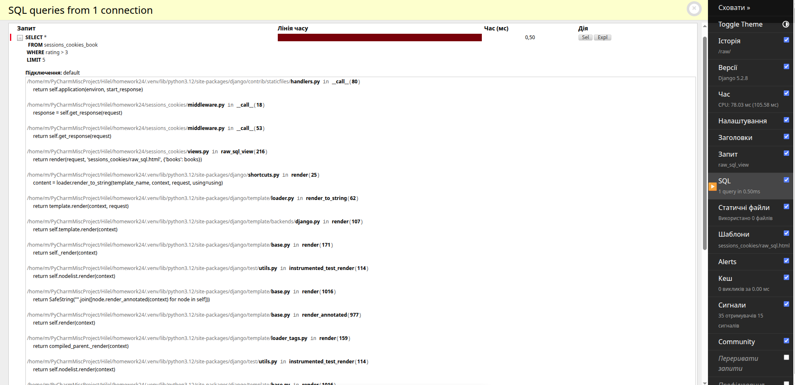
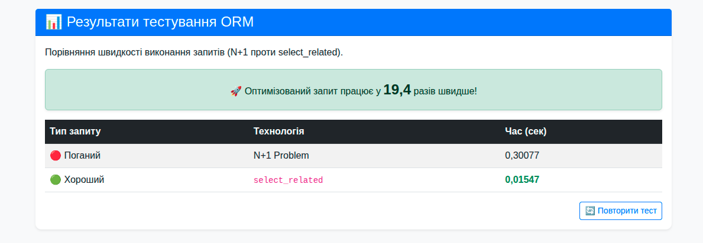
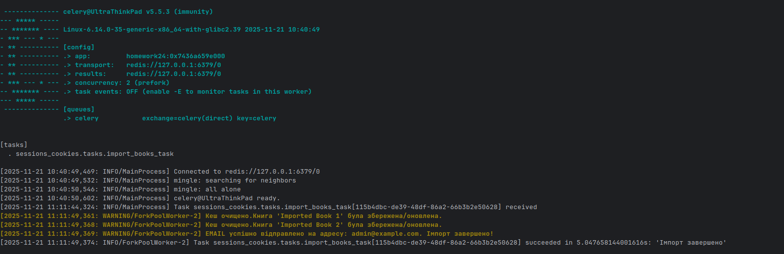
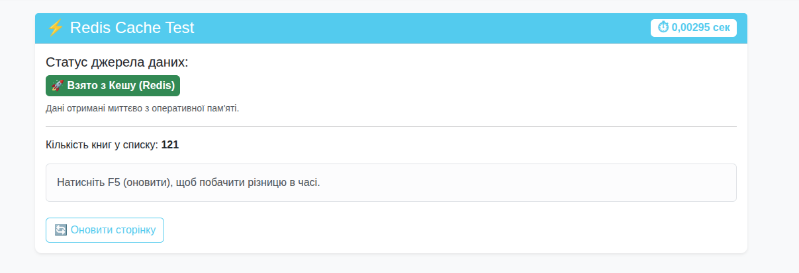

# 📘 BookAnalytics
## 🔍 Опис

**BookAnalytics** — система збору статистики книг у бібліотеці з оптимізованими ORM-запитами, кешуванням сторінок, асинхронною обробкою даних через Celery + Redis, а також вимірюванням продуктивності за допомогою django-debug-toolbar.

---

## 📌 Зміст

**1.** [⚙️ Встановлення та запуск](#-встановлення-та-запуск)

**2.** [🗄️ Архітектура та моделі](#-архітектура-та-моделі)

**3.** [👤 Cookies та сесії](#-cookies-та-сесії)

**4.** [⚡ Оптимізація ORM](#-оптимізація-orm)

**5.** [🧠 Кешування](#-кешування)

**6.** [🔧 Middleware кешування](#-middleware-кешування)

**7.** [📊 Аналіз продуктивності (Debug Toolbar)](#-аналіз-продуктивності)

**8.** [🚀 Асинхронні задачі Celery](#-асинхронні-задачі-celery)

**9.** [🖼 Галерея результатів](#-галерея-результатів)

**10.** [📈 Raw SQL, індексація та NoSQL](#-raw-sql-індексація-та-nosql)

---


# ⚙️ Встановлення та запуск
```bash
git clone <repo_url>
cd Homework24
python -m venv venv
source venv/bin/activate   # або venv\Scripts\activate на Windows
pip install -r requirements.txt
```

## 📌 Налаштування Redis (Ubuntu)
```bash
sudo apt install redis
sudo service redis-server start
```
## 🚀 Запуск сервера
```bash
python manage.py migrate
python manage.py runserver
```
## 🚦 Запуск Celery
```bash
celery -A homework24 worker -l info
```
# 🗄️ Архітектура та моделі

У проєкті використані моделі:


| Компонент | Використано |
|-----------|-------------|
| Backend | Django |
| Sessions | Django DB Sessions |
| Cookies | HttpOnly Cookies + auto-refresh |
| ORM | select_related, prefetch_related |
| Cache | Redis / Memcached |
| Async | Celery + Redis |
| Debug | Django Debug Toolbar |
| DB | PostgreSQL/MySQL/SQLite + MongoDB/Firebase |
| NoSQL | MongoDB/Firebase |
| Email | SMTP (локальний / сторонній) |

| Модель     | Опис               |
|------------|--------------------|
| `Author`   | Автор книги        |
| `Book`     | Книга              |
| `Review`   | Відгук з рейтингом |

Звʼязки:

* `Author → Book` (один-до-багатьох)
* `Book → Review` (один-до-багатьох)

---

# 👤 Cookies та сесії

У проекті реалізовані:

✔️ Збереження **імені в cookies**

✔️ Збереження **віку в сесії**

✔️ Автоподовження cookies при активності

✔️ Кнопка **«Вийти»** з видаленням даних

---

# ⚡ Оптимізація ORM

Порівняння запитів:

| Без оптимізації | Оптимізовано |
|-----------------|--------------|
|Багато SQL | ``select_related``, ``prefetch_related`` |
|Повільний рендер |	Збір потрібних даних одним запитом |
|Навантаження на БД |	Економія пам’яті |

---

# 🧠 Кешування

✔️ Кешування списку книг

✔️ Оновлення кешу при створенні/зміні книги

✔️ Заміна ручного кешу на Redis/Memcached

---

# 🔧 Middleware кешування
📌``` BookCacheMiddleware```

* Кешує **сторінку списку книг ```/analytics/``` лише для анонімних користувачів**

* Прискорює повторні запити

---

# 📊 Аналіз продуктивності

Використано **django-debug-toolbar** для:

* Аналізу SQL-запитів

* Виявлення надлишкових запитів

* Оптимізації шаблонів

* Перевірки швидкодії з кешем

---

# 🚀 Асинхронні задачі Celery

Celery виконує:

✔️ 📊 збір статистики по книгах

✔️ 📤 відправку email зі звітом

Завдання відправляють нотифікацію після завершення.

---

# 🖼 Галерея результатів
### 🔍 Аналіз Django Debug Toolbar
	

### ⚡ Порівняння продуктивності ORM


### 📨 Виконання Celery завдання


### 🧠 Кешування сторінки за допомогою Redis


---

# 📈 Raw SQL, індексація та NoSQL

✔️ Виконано сирі SQL-запити з безпечними параметрами

✔️ Додано індекси до моделей (```rating```, ```book_id```)

✔️ Порівняно продуктивність реляційної БД з **MongoDB/Firebase**

---
